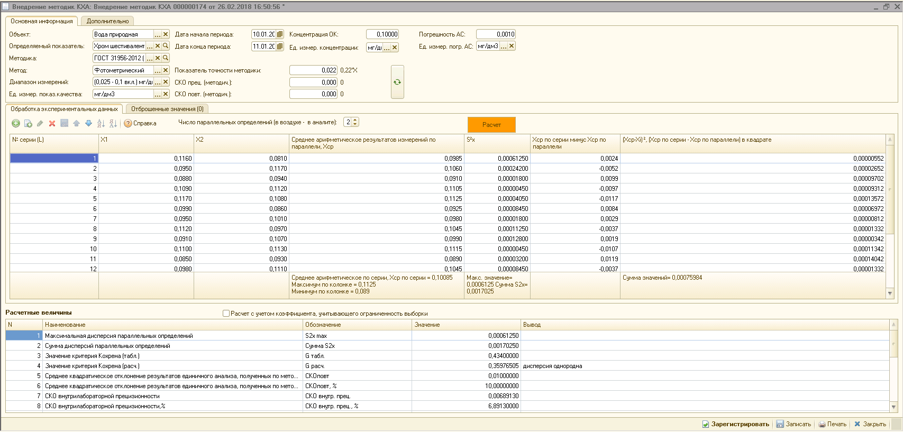
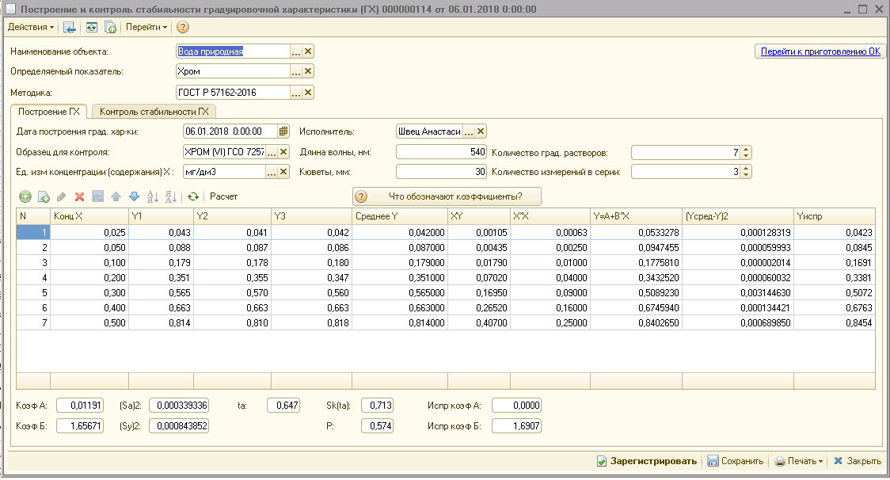

## Режим хранения\заведения результатов испытаний
  Должно быть разделение по видам оборудования. (что-то типа набор карточек с фото оборудования, названием, кратким описанием и т.д.)
  При нажатии на карточку отображается таблица с проведенными испытаниями, где указываются номер испытания, дата проведения, фио испытателя, комментарий. 
  При переходе в испытание что-то типа

  Нужно организовать какое-то отображение в виде аналитики со всякими чартами, импорт и экспорт результатов (например в json,xml или csv), формирование отчетов + скорее всего будет api с котрой нужно будет забирать результаты, поэтому сразу предусмотреть это и подготовить какую-то загрузку с api c конвертацией в нужный формат
  
## Режим `цифрового моделирования` и модуль выполнения подпрограмм
  Как я пока что представляю, должна быть возможность создания каких-то блоков, которые выполняют какие-то математические преобразования и возможность объединять эти блоки, посылать в них начальные данные и на выходе получать результат.
  Т.е. в блоки вставляется какой-то код (на интерпретируемом языке), потом всё это летит на сервер там вычисляется -> возвращается результат. Так же выполнением подпрограмм.
## Модуль заявок
  Возможно потребуется вести какие-то заявки на проведение испытаний.Тут по аналогии как было с idm системой: простое согласование,статус выполнения, добавление, удаление и т.д.
